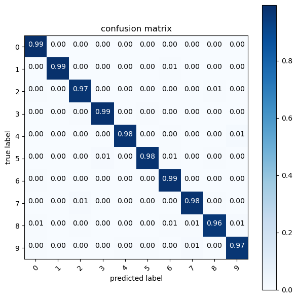

# DeepL

The aim of this project is to familiarize with pytorch and explore basic deep learning models with this library. This project is composed of a first notebook giving an introduction to how to use pytorch for regression and classification, and of 3 other notebooks detailing each the methodology used (from data processing to model evaluation) to implement deep learning models on image datasets such as MNIST or fashion-MNIST.

## Automatic differentiation
In this first notebook, we explain $y$ (output variable) as a function of one or several $x$ (input variables) using neural networks. Here, $x$ are continuous and $y$ can be continuous (*regression*) or discrete (*classification*). Both linear and nonlinear cases are covered in this notebook.

### Regression problems
At first, we deal with linear regression problems with linear layers. Then we use ReLU activation function to deal with non-linear regression problems.

### Classification problems
We use a logistic regression model to deal with a binary classification problem by using a sigmoid function to the last layer of the linear model.

### Automatic differentiation
Finally, we explore automatic differentiation wich the base computation method used in gradient-descent to minimize the cost function. Afterwards, we use automatic differentiation to optimize a 2D function.

## MLP on MNIST
In this notebook, we train **Multi-Layer Perceptron** (MLP) models to predict to which class MNIST images belong.
We detail each step : data vizualisation, data splitting, training, evaluating.

We use a simple MLP with one layer at first and then we try a deeper MLP. We obtain an overall test accuracy of 0.98.

## CNN on MNIST
In this notebook, we train **Convolutional Neural Networks** (CNN) models to predict to which class MNIST images belong. We detail each step : data vizualisation, data splitting, training, evaluating.

We use 2 consecutive convolutional layers using 32 3x3 filters with stride 1 followed by *ReLU* activation, a max pooling with vertical and horizontal downscale of 2, a flatten operator to flatten the input array, and a dense layer with 10 units. We obtain an overall test accuracy of 0.98.

## Fashion MNIST
In this notebook we aim to perform classification on Fashion-MNIST using multi-layer perceptron, convolutional neural networks and transfer learning to obtain the best classification results as possible.

### MLP:
We use an MLP architecture with 2 fully-connected layers and a dropout layer. We obtain an overall test accuracy of 87,94%.

### CNN:
We use a CNN architecture with 2 patterns [CONV - CONV - POOL] as well as dropout and fully-connected layers. We obtain an overall test accuracy of 82,34%.

### Finetuning vgg16:
We finetune vgg16 by adding fully connected layers as classifier of the pretrained vgg16 model. We obtain an overall test accuracy of 94,67%.
